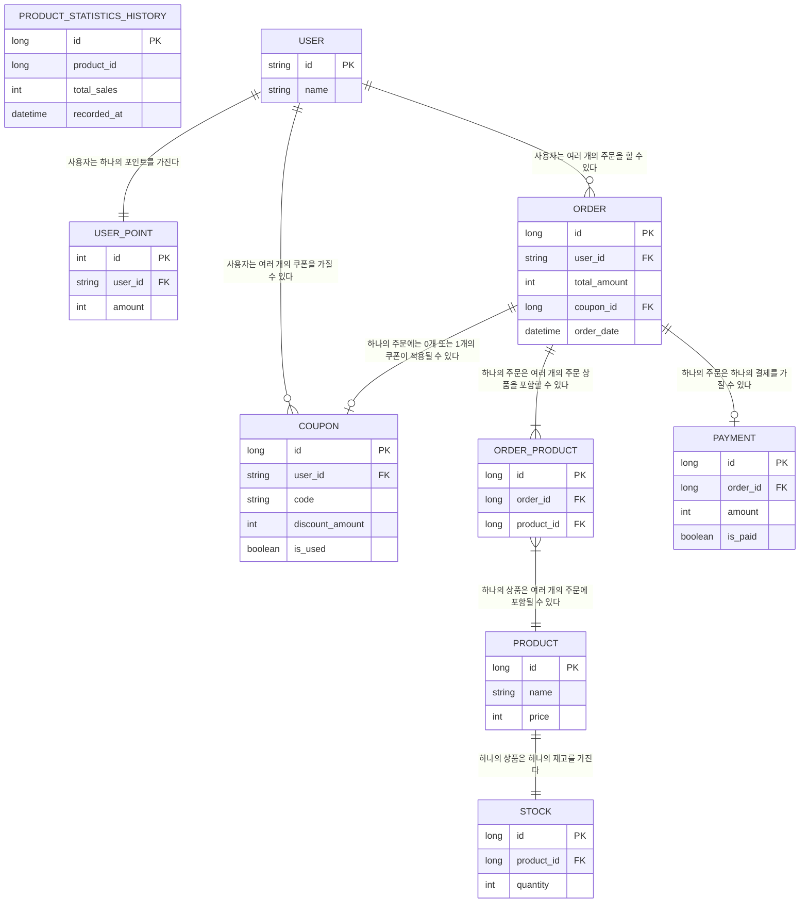

# ERD

```mermaid
erDiagram

    %% 통계 관련 테이블
    PRODUCT_STATISTICS_HISTORY {
        long id PK
        long product_id
        int total_sales
        datetime recorded_at
    }

    %% 사용자 관련 테이블
    USER {
        string id PK
        string name
    }

    USER_POINT {
        int id PK
        string user_id FK
        int amount
    }

    COUPON {
        long id PK
        string user_id FK
        string code
        int discount_amount
        boolean is_used
    }

    %% 주문 및 결제 관련 테이블
    ORDER {
        long id PK
        string user_id FK
        int total_amount
        long coupon_id FK
        datetime order_date
    }

    ORDER_PRODUCT {
        long id PK
        long order_id FK
        long product_id FK
    }

    PAYMENT {
        long id PK
        long order_id FK
        int amount
        boolean is_paid
    }

    %% 상품 관련 테이블
    PRODUCT {
        long id PK
        string name
        int price
    }

    STOCK {
        long id PK
        long product_id FK
        int quantity
    }

    %% 관계 정의
    USER ||--o{ ORDER : "사용자는 여러 개의 주문을 할 수 있다"
    USER ||--|| USER_POINT : "사용자는 하나의 포인트를 가진다"
    USER ||--o{ COUPON : "사용자는 여러 개의 쿠폰을 가질 수 있다"

    ORDER ||--|{ ORDER_PRODUCT : "하나의 주문은 여러 개의 주문 상품을 포함할 수 있다"
    ORDER ||--o| PAYMENT : "하나의 주문은 하나의 결제를 가질 수 있다"
    ORDER ||--o| COUPON : "하나의 주문에는 0개 또는 1개의 쿠폰이 적용될 수 있다"

    ORDER_PRODUCT }|--|| PRODUCT : "하나의 상품은 여러 개의 주문에 포함될 수 있다"
    PRODUCT ||--|| STOCK : "하나의 상품은 하나의 재고를 가진다"
```