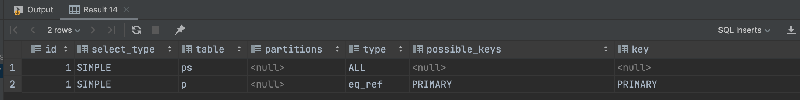
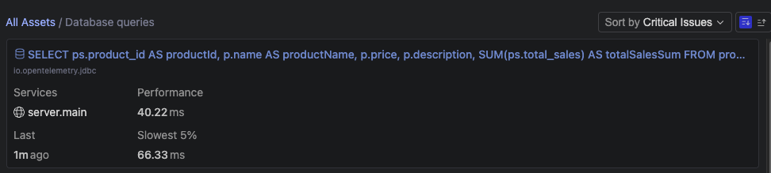
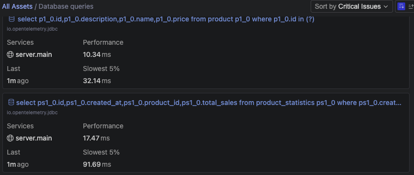
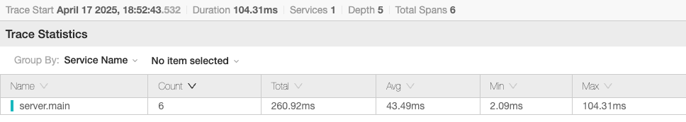
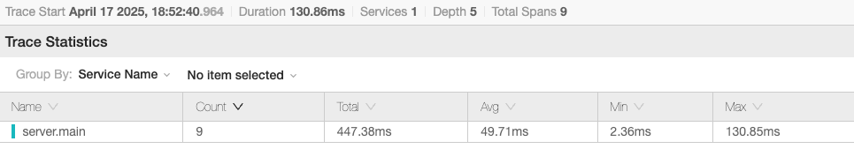
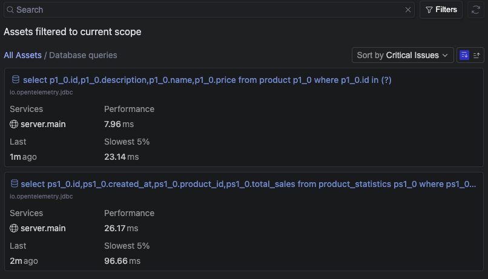
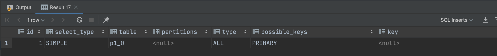
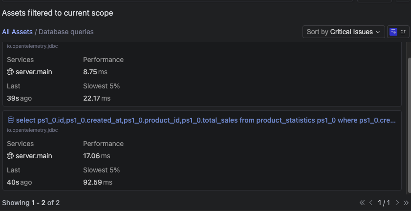
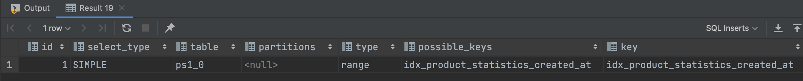
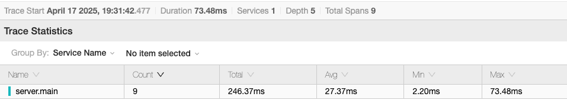

# 보고서: 인기 판매 상품 조회 API 쿼리 최적화

## 1. 배경 및 현황

- API: GET /products/top
- 목적: 최근 3일간의 판매량을 기준으로 인기 상품 Top 5 조회
- 현 구조:
  - orders 테이블에서 하루 단위로 집계
  - 결과를 productStatistics 테이블에 저장
  - API에서는 해당 테이블만 조회

### ✅ product_statistics 집계 테이블 활용한 이유

인기 판매 상품 API는 **전날을 기준으로 최근 3일간의 판매량을 집계하여 Top 5 상품을 조회**하는 기능입니다.  
요구사항 상 **실시간 데이터가 아닌 일정 주기 집계를 기반으로 동작**하므로, orders 테이블에서 직접 계산하지 않고 **집계 테이블(product_statistics)을 활용하는 구조가 더 적합**하다고 판단했습니다.

- 집계 테이블 활용의 이점
  1. **데이터 양 감소에 따른 성능 향상**
     - orders 테이블은 시간이 지날수록 **데이터가 기하급수적으로 증가**하여, 직접 조회 시 조회 비용이 매우 커집니다.
     - 반면, product_statistics는 하루 단위로 집계된 데이터만 저장하므로 **행 수가 현저히 적고**, 인덱스를 통해 **빠르게 범위 조회 및 정렬**이 가능합니다.
  2. **응답 속도 개선 및 실시간 트래픽 대응**
     - API는 단순 조회만 수행하며, 집계 처리는 비실시간 배치로 분리되어 있어 **API 응답 속도가 빠르고 안정적**입니다.
     - 실시간 트래픽이 몰려도 **조회 성능에 영향을 주지 않아 운영 안정성**이 높습니다.
  3. **읽기/쓰기 연산 분리로 인한 시스템 부하 완화**
     - orders 테이블은 **지속적으로 쓰기 연산이 발생**하므로, 여기에 복잡한 조회를 수행하면 성능 저하 및 락이 발생할 수 있습니다.
     - 집계 테이블을 활용하면 **읽기 연산과 쓰기 연산을 명확하게 분리**하여 전체 시스템 부하를 분산시킬 수 있습니다.
  4. **유지보수 및 확장성 측면에서 유리**
     - 집계 주기를 변경하거나 통계 항목을 추가할 경우에도, **조회 API 로직은 변경 없이 유지**할 수 있어 확장성과 유지보수성이 뛰어납니다.

따라서, 인기 판매 상품 조회는 **실시간성이 요구되지 않는다는 점**, **주문 데이터를 효율적으로 처리해야 한다는 점, 운영 안정성을 고려해야 한다는 점**에서 product_statistics 집계 테이블 활용이 더 적절한 선택이라 할 수 있습니다.

### ✅ 주문 정보 조회 방식 비교

| 구분 | Orders 테이블 직접 조회 | 집계 테이블(product_statistics) 활용 |
|-----|---------------------|----------------------------------|
| 설명 | 매 요청 시 orders 테이블에서 집계 쿼리를 수행 | 미리 집계된 결과(product_id, total_sales, created_at)를 별도 테이블에 저장하고 조회 |
| 장점 | 실시간 데이터 반영 가능, 별도 저장 공간 불필요 | 빠른 응답 속도, 쿼리 부하 감소, 복잡한 연산 생략 가능 |
| 단점 | 데이터가 많아질수록 응답 시간 증가, DB 부하 심화, 인덱스 튜닝이 필요하고 한계 존재 | 집계 주기 설정 필요 (ex. 매일 밤), 최신 데이터 반영까지 시간 차이 존재, 배치 실패 시 데이터 누락 가능 |

## 2. 문제점
현재 API에서는 product_statistics 테이블에서 최근 3일간의 데이터를 조회한 뒤, 상품 ID별로 그룹화하여 합산하고, 정렬 후 상위 5개만 추출(LIMIT)하는 쿼리를 수행하고 있습니다.  
하지만 다음과 같은 문제점이 존재합니다.

### ✅ 1. 인덱스 부재로 인한 테이블 전체 스캔
created_at 또는 product_id에 적절한 인덱스가 없는 경우, WHERE 절에서의 날짜 필터링조차 효율적으로 동작하지 않아 전체 테이블 스캔(Full Table Scan)이 발생합니다.  

### ✅ 2. 데이터 증가에 따른 응답 지연
product_statistics 테이블은 매일 집계된 데이터를 저장하기 때문에 시간이 지날수록 누적 행 수가 증가합니다.  
현재는 몇 만 건 수준이라도, 월 단위로 수십만 건까지 쌓일 수 있으며, 이 경우 집계 → 정렬 → LIMIT 추출까지 모든 연산에 비용이 증가하게 됩니다.  

### ✅ 3. 코드 일관성 측면에서 문맥의 단절
Java/Kotlin은 절차적이거나 객체지향적인 흐름 속에서 클래스, 메서드, 타입, 로직 흐름 등으로 구성됩니다.  
반면 SQL은 선언형 질의 언어로, 단 한 줄로 여러 개의 데이터를 추출하고 조합하는 방식이죠.
두 세계관은 근본적으로 다른 사고방식을 요구합니다.  
그래서 Java/Kotlin 흐름 속에 갑작스레 SQL이 들어오면 문맥이 끊기고 몰입이 깨지게 됩니다.  

## 3. 우선시하는 가치

| 가치 | 설명                              |
| --- |---------------------------------|
| 유지보수성 | 코드의 가독성이 좋아야하며 디버깅, 리팩토링이 쉬어야 함 |
| 실시간 응답 속도 | 메인 홈 등에서 빠르게 로딩되어야 함            |
| 시스템 단순성 | 부가적인 시스템(Redis 캐시 등) 없이 운영 유지   |

## 4. 해결 방안: 쿼리 최적화 및 인덱스 설계

> 테스트 데이터는 상품 10건, 통계 10,000건으로 테스트했습니다.

### ✅ 방안 1: **전체 3일치 데이터를 메모리에 올려서 애플리케이션 내에서 계산**
SQL에서 모든 계산 로직을 처리하면
애플리케이션의 객체지향적 흐름(Java/Kotlin) 속에 절차적이고 선언적인 SQL이 끼어들어 문맥이 끊기게 됩니다.  
이는 개발자 입장에서 코드 이해도를 떨어뜨리고, 리팩토링을 어렵게 만들며, 테스트 작성도 어렵게 만든다고 생각합니다.

반면, 쿼리는 단순하게 "필요한 데이터만 가져오고",계산은 애플리케이션에서 처리하면 역할이 명확히 분리되므로 유지보수성과 협업 효율이 훨씬 높아진다고 생각합니다.  

 

#### ✔ 트레이드오프

| 항목 | 장점 | 단점 |
| --- | --- | --- |
| 성능 | 적은 양일 경우 빠르고 안정적 | 데이터 양이 많을 경우 메모리 사용 증가 |
| 유지보수 | 객체지향 흐름 유지, 리팩토링 용이 | 쿼리보다 약간의 코드 작성 비용 |
| 확장성 | 다양한 필터 조건 등 유연한 대응 가능 | 실시간 대용량 집계에는 추가 최적화 필요 |

  

#### ✔ 쿼리 속도 개선
각각의 쿼리 자체의 속도는 단순 조회로 최적화하여 속도가 현저히 개선되었습니다.   

#### ✔ 전체 성능 비교
하지만, 쿼리 한 번으로 처리하는 방식에 비해 전체적인 성능은 저하되었습니다.  
쿼리에서 모든 계산을 하지 않고, 데이터를 메모리에 올려 애플리케이션 내에서 계산을 진행하게 되면, 전체 성능에 미치는 영향은 단순히 쿼리 속도 개선을 넘어서는 문제입니다.
* As-Is
  
* To-Be
  

### ✅ 방안 2: **DB 인덱스를 활용한 쿼리 최적화**
인덱스를 추가하여 조회 속도 개선을 달성했습니다.  
As-Is 상태에서는 풀 스캔이 발생하여 성능 저하가 있었지만, To-Be 상태에서는 인덱스를 통해 미미하지만 좀 더 빠르게 데이터를 조회할 수 있게 되었습니다.  
* As-Is
  
  
* To-Be
  
  
  
인덱스를 추가한 후, 쿼리 속도는 비교적 빨라졌고, 풀 스캔을 피한 방식으로 처리되었음을 EXPLAIN 및 Digma 결과로 확인할 수 있었습니다. 이를 통해 DB 성능이 개선되었음을 명확하게 알 수 있습니다.  

DB 성능이 개선됨에 따라 전체 API 성능도 개선되었음을 알 수 있습니다.
* As-Is
  
* To-Be
  

결론적으로, 인덱스를 통한 쿼리 최적화는 단일 SQL 성능만 개선한 것이 아니라, 전체 API의 응답 속도 향상으로 이어지며 시스템 전반의 사용자 경험 개선에도 긍정적인 영향을 미쳤습니다.