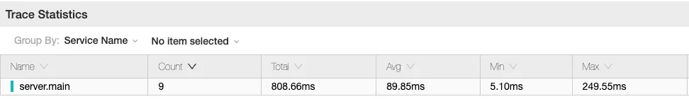
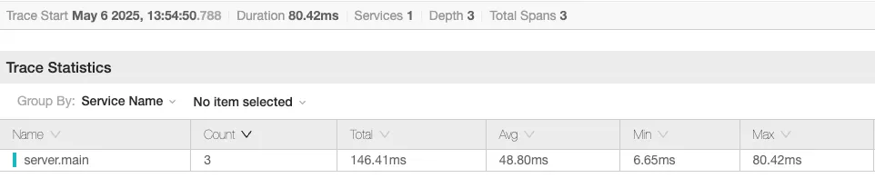

# 보고서: 인기상품 조회 성능 개선을 위한 Redis 캐싱 전략 적용

## 1️⃣ 배경: 증가하는 트래픽과 반복되는 DB 조회

인기상품 조회는 거의 모든 사용자가 진입 시 호출됩니다.  
인기상품은 일정 주기로 갱신되며 자주 변경되지 않지만 호출 빈도는 매우 높습니다.  
동일한 요청에 대해 **반복적인 DB 조회** 발생하고 결국은 **불필요한 리소스 낭비**로 이어집니다.

| 항목 | 설명 |
| --- | --- |
| 📋 호출 구조 | API 호출 → DB 조회 → 정렬 후 반환 |
| 📦 데이터 특성 | 주기적 배치로 갱신되는 정적 데이터 |
| 🔄 요청 빈도 | 사용자 진입 시마다 반복 호출 |
| ⚠️ 병목 지점 | 매 요청마다 DB로부터 계산된 데이터 조회 |

---

## 2️⃣ 문제 정의: 인기상품 API의 병목 지점

인기상품은 "최근 3일간 판매량 상위 5개 상품"을 반환하는 API로 현재 구조는 아래와 같습니다.

```
Client ──▶ API Server ──▶ DB (인기상품 필터링 + 조회) ──▶ 애플레케이션 계산 ──▶ 응답
```

하지만 해당 API는 다음과 같은 문제점이 있었습니다.
- 인기상품 API 응답 지연 (최대 250ms 이상)
- 데이터는 자주 변경되지 않지만 호출 빈도가 높음
- DB CPU 사용률 상승
- 스파이크 트래픽 발생 시 API 장애 위험

---

## 3️⃣ 해결 방안: Redis 캐시 도입을 통한 성능 개선

### ✅ 적용 대상
- 인기상품 조회 API: /api/products/best
- 조회 조건: 최근 3일 기준 판매량 상위 5개 상품

### 🧠 캐싱 전략
- Redis를 사용한 캐싱 도입

| 항목 | 전략 |
| --- | --- |
| 🔑 캐시 키 | findTopSellingProducts |
| ⏱ TTL (유효기간) | 1일 또는 배치 완료 시 갱신 |
| 📚 캐시 방식 | Look Aside 패턴 |
| 🧵 갱신 트리거 | 배치 후 갱신 or TTL 만료 |

### 💡 Cache Aside 패턴 적용
  - 캐시에 데이터가 없을 경우 → DB 조회 후 캐시에 저장
  - 캐시에 데이터가 있을 경우 → Redis에서 바로 응답

### 📌 [참고] Cache 어노테이션
Spring은 총 4가지의 Cache 어노테이션을 제공합니다.

#### 1. @Cacheable

읽기 작업을 수행하는 메서드에 사용되는 어노테이션입니다.  
해당 어노테이션은 메서드의 특정 인자에 대한 메서드 결과값을 캐시 저장소에 key값으로 저장하고 이미 캐시되어 있다면 캐시 저장소에서 가져와 반환합니다.

| 옵션 | 설명 |
| --- | --- |
| value | 저장될 캐시 이름을 설정 |
| cacheNames | 저장될 캐시 이름을 설정 (value랑 같음) |
| key | Spring 표현식을 사용하여 동적으로 달라지는 메서드의 파라미터 값을 선언 |
| condition | Spring 표현식을 사용해 해당 조건을 만족할 때만 캐시에 저장 |
| unless | Spring 표현식을 사용해 해당 조건을 만족할 때만 캐시에 저장하지 않음 |
| sync | 동기화 여부를 설정 |

#### 2. **@CacheEvict**

저장된 캐시를 제거할 때 사용됩니다.
위 코드 샘플은 키 값을 지정해 해당 키 값만 캐시에서 제거하도록 했습니다.

> 참고로 사용된 옵션은 @Cacheable 의 옵션과 동일합니다.

여기서 사용된 캐시 전략은 Look Aside + Write Around 조합이 사용 되었습니다.  
그렇기 때문에 DB에 저장된 데이터가 수정, 추가, 삭제 될 때마다 Cache 또한 삭제해주어야 합니다.  
만약 데이터가 변경될 때마다 캐시를 비워주지 않으면캐시 DB(Redis)와 하드 DB(MySQL)의 데이터가 서로 다른 데이터를 갖고 있어 캐시 DB에서 데이터를 꺼내 올 때 변경되기 전인 오래된 정보를 사용하는 데이터정합성 문제점이 발생합니다.  
그렇기 때문에 데이터가 변경 될 때마다 캐시를 제거해주는 작업이 중요합니다.

#### 3. @CachePut
메서드의 결과값을 항상 캐시에 저장합니다.  
때문에 캐시 존재 여부를 신경쓰지 않고 메서드를 실행하고 결과를 캐시 저장소에 저장합니다.
주로 update 작업에 사용합니다.  

#### 4. @Caching
여러 캐시 작업을 한번에 처리합니다. (Cachable, CachePut, CacheEvict 어노테이션들을 복합적으로 사용해 캐시를 처리할 수 있습니다.)  

```java
@Caching(
    cacheable = {
        @Cacheable(value = "userId", key = "#userId"),
        @Cacheable(value = "userEmai", key = "#email")
    }
)
public void complexCacheOperation(User user) {
	... 생략
}
```

### 📌 [참고] 캐싱 전략 패턴 종류
#### 캐시 읽기 전략 (Read Cache Strategy) - Look Aside 패턴
- Cache Aside 패턴이라고도 불림.
- 데이터를 찾을때 우선 캐시에 저장된 데이터가 있는지 우선적으로 확인하는 전략.  
  만일 캐시에 데이터가 없으면 DB에서 조회함.
- 반복적인 읽기가 많은 호출에 적합.
- 캐시와 DB가 분리되어 가용되기 때문에 원하는 데이터만 별도로 구성하여 캐시에 저장
- 캐시와 DB가 분리되어 가용되기 때문에 캐시 장애 대비 구성이 되어있음.  
  만일 redis가 다운 되더라도 DB에서 데이터를 가져올수 있어 서비스 자체는 문제가 없음.  
- 대신에 캐시에 붙어있던 connection이 많았다면, redis가 다운된 순간 순간적으로 DB로 몰려서 부하 발생.
- 동작 방식
  - cache store에 검색하는 데이터가 있는지 확인
  - cache store에 없을 경우 DB에서 데이터 조회
  - DB에서 조회해온 데이터를 cache store에 업데이트

#### 캐시 쓰기 전략 (Write Cache Strategy) - Write Around 패턴
- Write Through 보다 훨씬 빠름
- 모든 데이터는 DB에 저장 (캐시를 갱신하지 않음)
- Cache miss가 발생하는 경우에만 DB와 캐시에도 데이터를 저장
- 따라서 캐시와 DB 내의 데이터가 다를 수 있음 (데이터 불일치)
- 동작 방식
  - 모든 데이터는 DB에 저장 

---

## 4️⃣ 구현 상세 및 테스트
### 🔧 Spring Boot + Redis 캐시 설정
- 인기상품 서비스에 `@Cacheable` 활용
    ```kotlin
    @Cacheable(cacheNames = ["findTopSellingProducts"])
    fun findTopSellingProducts(): List<ProductInfo.FindTopSales> {
        // DB 조회 및 가공 로직
    }
    ```

- 배치 후 갱신용 `@CacheEvict` 추가
    ```kotlin
    @CacheEvict(cacheNames = ["findTopSellingProducts"], allEntries = true)
    fun clearProductStatisticsCache() {
    }
    ```

- 현 API에 특성을 고려한 적절한 TTL 설정
    ```kotlin
    @Bean
    fun redisCacheConfiguration(): RedisCacheConfiguration {
        return RedisCacheConfiguration.defaultCacheConfig()
            .serializeKeysWith(RedisSerializationContext.SerializationPair.fromSerializer(StringRedisSerializer()))
            .serializeValuesWith(
                RedisSerializationContext.SerializationPair.fromSerializer(
                    GenericJackson2JsonRedisSerializer(redisObjectMapper())
                )
            )
            .entryTtl(Duration.ofDays(1))
    }
    ```

### 📊 [비교 데이터] Redis 적용 전/후 응답 속도 비교

- 적용 전


- 적용 후


### 📉 성능 개선 확인
| 테스트 조건 | Redis 미적용 | Redis 적용 |
| --- | --- | --- |
| 평균 응답 속도 | **89ms** | **48ms** |
| 최대 응답 시간 | 249ms | 80ms |

**결과적으로 Redis 적용을 통해 평균 응답 속도는 약 46% 감소했으며, 특히 최대 응답 시간은 약 68%나 크게 감소했습니다.**

---

## 5️⃣ 한계점 및 향후 고려사항

- **데이터 정합성 문제**
    - 실시간 데이터 반영 어려움
    - 현재는 일정 시간 후 캐시를 삭제하며 갱신을 하고 있지만 TTL과 캐시 삭제 사이 지연 가능성
    - 보완: 중요 시점마다 수동 캐시 삭제
- **캐시 고갈 시 성능 하락 가능성**
    - Redis 장애 대비 fallback 로직 필요
- **Redis 과부하 방지**
    - Key 수, TTL 전략, evict 정책 고려 필요

---

## 6️⃣ 결론

- Redis 캐싱 도입으로 인기상품 조회 API의 **평균 응답 속도는 약 46% 감소했으며, 특히 최대 응답 시간은 약 68% 감소**
- 적절한 TTL 및 갱신 전략을 병행하면 **데이터 정합성과 성능을 모두 확보 가능**

### 🎯 **추천 전략**
- 조회가 많고 변경이 적은 데이터에 Redis 캐싱 적용
- Look Aside 패턴을 기본으로, 명시적 갱신 로직 병행
- 캐시 상태 모니터링 + 장애 대비 fallback 로직 구성