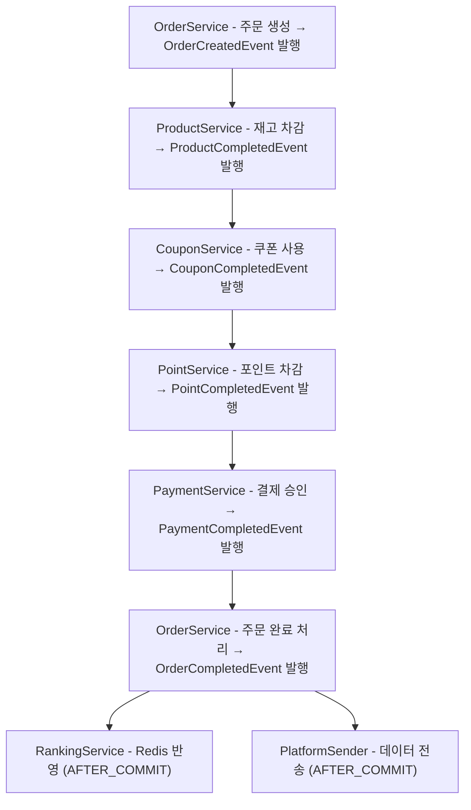

# MSA 전환을 위한 도메인 기반 서비스 설계 보고서

## 1️⃣ 도메인 분리 설계

MSA에서는 각 도메인을 명확히 정의하고, 비즈니스 역활 단위로 마이크로서비스를 분리합니다. 아래는 이커머스 플랫폼을 기준으로 한 도메인별 마이크로서비스 분리안입니다.

`OrderFacade`를 기준으로 분석한 결과, 다음과 같이 마이크로서비스 단위로 도메인을 분리할 수 있습니다

| 마이크로서비스 | 책임 도메인 설명 |
| --- | --- |
| **User Service** | 사용자 정보 조회, 포인트 잔액 확인 등 |
| **Product Service** | 상품 정보 조회, 재고 확인 및 차감 처리 |
| **Coupon Service** | 쿠폰 정보 조회, 쿠폰 사용 처리 |
| **Order Service** | 주문 생성 및 상태 변경 관리 |
| **Payment Service** | 결제 요청, 승인 및 취소 처리 |
| **Point Service** | 포인트 사용 및 적립 처리 |
| **Ranking Service** | 구매 기반 랭킹 업데이트 처리 |
---

## 2️⃣ 이벤트 체인 기반 순차 실행 설계

서비스 간 직접적인 호출 없이 이벤트 발행 기반으로 순차적 처리를 유도하는 구조를 설계하여, 도메인 간의 결합도를 낮추고 자연스러운 흐름을 구성하였습니다.

각 서비스는 이전 단계의 이벤트를 수신하여 작업을 수행한 후, 다음 단계의 이벤트를 발행하는 구조로 설계되어 있습니다.

### ✅ 이벤트 흐름 시나리오



1. **OrderService**
    - 주문 생성
    - → `OrderCreatedEvent` 발행
2. **ProductService**
    - OrderCreatedEvent 리스너
    - 재고 차감 수행
    - → `ProductCompletedEvent` 발행
3. **CouponService**
    - ProductCompletedEvent 리스너
    - 쿠폰 사용 처리
    - → `CouponCompletedEvent` 발행
4. **PointService (리스너)**
    - CouponCompletedEvent 리스너
    - 포인트 차감 수행
    - → `PointCompletedEvent` 발행
5. **PaymentService**
    - PointCompletedEvent 리스너
    - 결제 승인 처리 저장
    - → `PaymentCompletedEvent` 발행
6. **OrderService (리스너)**
    - PaymentCompletedEvent 리스너
    - 주문 상태 최종 완료 처리
    - → `OrderCompletedEvent` 발행
7. **RankingService**
    - 커밋 이후 Redis에 랭킹 정보 반영
8. **PlatformSender**
    - 커밋 이후 비동기 전송 수행

### ✅ 기술적 구현

- 이벤트 간 연결은 `@EventListener` 와 `ApplicationEventPublisher`를 활용하여 느슨하게 연결
- 각 단계는 이전 단계 이벤트 수신 후 비즈니스 로직 처리 → 다음 단계 이벤트 발행
- 이벤트 리스너는 같은 트랜잭션 내에서 실행됨
    - 즉, 하나의 요청 흐름 전체가 하나의 트랜잭션으로 묶임
    - 예외 발생 시 전체 롤백

### ✅ 장점

- 파사드 제거
- 서비스 간 직접 호출 제거로 결합도 감소
- 순차적인 흐름을 명확하게 추적 가능
- 트랜잭션 내부에서 실행되므로 정합성 유지
- 각 도메인의 책임이 명확히 분리됨

### ✅ 고려사항

- `@EventListener` 기반 이벤트 체인은 **동기 처리**이므로, 단계 중 하나라도 지연되면 전체 처리가 지연됨
- 트랜잭션 내부에서 모든 작업을 수행하므로 트랜잭션 범위가 커질 수 있음
    - 트랜잭션 시간 증가 → DB 락 보유 시간 증가
    - 향후 일부 비동기 분리 필요성 존재

---

## 3️⃣ @TransactionalEventListener의 phase 차이와 동작 이슈
이벤트 기반 설계에서 트랜잭션의 커밋 시점에 따라 이벤트 실행 시점을 제어할 수 있도록 `@TransactionalEventListener`의 `phase` 속성을 사용할 수 있습니다.

### ✅ @TransactionalEventListener(phase = TransactionPhase.BEFORE_COMMIT)

- **트랜잭션이 커밋되기 전에** 이벤트 리스너가 실행됩니다.
- 트랜잭션 내에서 실행되므로, **롤백되면 이 리스너에서 한 작업도 함께 롤백됩니다.**
- 예외가 발생하면 트랜잭션 커밋도 중단되고 롤백됩니다.
- 사용 예:
   - DB에 저장하기 전, 로그 기록
   - 무언가 추가 검증 작업을 하거나, 같은 트랜잭션 내에서 같이 커밋되어야 하는 작업

### ✅ @TransactionalEventListener(phase = TransactionPhase.AFTER_COMMIT)

- **트랜잭션이 성공적으로 커밋된 후에** 실행됩니다.
- 트랜잭션 바깥에서 실행되므로, **이 리스너에서 예외가 발생해도 트랜잭션 결과에 영향이 없습니다.**
- 주로 **이벤트 발송, 알림, 외부 시스템 연동, 비동기 처리** 등에 적합합니다.
- 사용 예:
   - 이메일 발송
   - Slack/카카오톡 알림 전송
   - 외부 API 호출

### ✅ @TransactionalEventListener 동작 시점

| Phase 종류 | 실행 시점 | 특징 |
| --- | --- | --- |
| `BEFORE_COMMIT` | 트랜잭션 **커밋 직전**에 이벤트 실행 | 커밋 전에 후속 로직 처리 가능 |
| `AFTER_COMMIT` (기본값) | 트랜잭션 **커밋 완료 후**에 이벤트 실행 | 커밋 후에 외부 연동, 비동기 등 안정적으로 수행 |
| `AFTER_ROLLBACK` | 트랜잭션 **롤백 직후** 이벤트 실행 | 롤백 후 보상처리 등에 유용 |
| `AFTER_COMPLETION` | 트랜잭션 **성공/실패와 무관하게 종료 후** 이벤트 실행 | 트랜잭션 결과에 관계없이 실행됨 |

---

## 4️⃣ BEFORE_COMMIT을 사용하지 못한 이유
> #### 현상 요약
> 이벤트 체인 구조에서 하나의 이벤트를 처리하는 리스너 내부에서 또 다른 이벤트를 ApplicationEventPublisher.publishEvent()로 동기 발행한 경우, @TransactionalEventListener(phase = TransactionPhase.BEFORE_COMMIT)가 실행되지 않는 현상이 발생함.  

### 📌 상세 원인 분석
Spring에서 @TransactionalEventListener(phase = TransactionPhase.BEFORE_COMMIT)는 트랜잭션 커밋 직전에 실행되도록 설계된 리스너입니다.  
이 리스너는 Spring의 트랜잭션 동기화 매니저에 의해 커밋 직전 큐에 등록되어 실행되며, 반드시 트랜잭션 경계 내부에서 발생한 이벤트만 감지할 수 있습니다.

그러나 다음과 같은 조건이 충족될 경우, 이 리스너는 동작하지 않게 됩니다.

### ⚠️ 상황
1. A 이벤트가 발행됨 → @TransactionalEventListener 리스너가 호출됨
2. 이 리스너 메서드 내부에서 B 이벤트를 ApplicationEventPublisher.publishEvent()로 다시 발행함 (동기 방식)
3. 이 B 이벤트를 처리하는 리스너에 @TransactionalEventListener(phase = BEFORE_COMMIT)가 사용됨

### ➡️ 기술적 원인
1. `BEFORE_COMMIT`은 **현재 트랜잭션의 커밋 직전에 실행될 이벤트**를 스케줄링해두는 방식입니다.
2. 그런데 `ApplicationEventPublisher`를 통해 이벤트를 발행하면 그 이벤트는 **즉시 이벤트 디스패처에 의해 동기 처리**됩니다.
3. 이때 현재 트랜잭션은 아직 커밋되지 않은 상태이므로,
   - 내부적으로는 `BEFORE_COMMIT` 이벤트가 실행 대기 리스트에 올라가 있지만,
   - 그 내부에서 **또 다른 이벤트를 발행하면**, 이 이벤트는 "별도의 트랜잭션 컨텍스트 없이" 처리되거나 **BEFORE_COMMIT에 등록되지 않습니다**.

### 🌊 결론

이벤트 간 연결은 @EventListener 사용

---

## 5️⃣ 트랜잭션 처리의 한계

기존 모놀리식 환경에서는 하나의 DB 내에서 ACID 트랜잭션으로 전체 주문 흐름을 보장할 수 있었습니다. 그러나 MSA 전환 후에는 다음과 같은 문제들이 발생합니다

- 서비스 간 트랜잭션 일관성 보장 불가
- 중간 단계 실패 시 롤백 어려움
- 보상 트랜잭션 구현 부담
- 데이터 정합성 위반 가능성

```
1. Order Service → 주문 생성
2. Product Service → 재고 차감
3. Coupon Service → 쿠폰 사용 처리
4. Point Service → 포인트 차감
5. Payment Service → 결제 요청
6. Ranking Service → 랭킹 반영
7. Event Service → 이벤트 발행

```

> 이 흐름 중 하나라도 실패할 경우 전체 처리가 중단되거나, 데이터 불일치가 발생할 수 있음

---

## 6️⃣ 트랜잭션 처리 전략 및 해결 방안

### 1. **이벤트 브로커 기반 비동기 처리**

#### ✅ 개요

서비스 간 직접 호출 대신, **이벤트 브로커(Kafka, RabbitMQ 등**)를 활용하여 **비동기 이벤트 발행/구독 구조**로 서비스 간 트랜잭션 흐름을 구성합니다.

#### ✅ 방식

- 각 서비스는 비즈니스 로직을 처리한 뒤, **이벤트를 브로커에 발행(Publish)** 합니다.
- 관련된 다른 서비스는 이 이벤트를 **구독(Subscribe)** 하여 다음 처리를 수행합니다.
- 각 이벤트 처리 로직은 **로컬 트랜잭션** 내에서 동작하므로 **서비스 간 결합을 최소화**하면서도 **순차적 비즈니스 흐름**을 유지할 수 있습니다.

#### ✅ 장점

- 서비스 간 **느슨한 결합** 유지
- 장애 격리 및 재처리 가능
- 확장성과 유연성 우수

#### ✅ 단점 및 고려 사항

- **최종 일관성(Eventual Consistency)** 보장 필요
- **중복 처리**, **이벤트 순서 보장**, **오류 복구 전략** 필요
- 이벤트 유실 방지를 위한 **Outbox 패턴 + CDC(Change Data Capture)** 고려

### 2. **사가 패턴 (Event-driven Saga)**

#### ✅ 정의

Saga는 **장기 실행 트랜잭션을 여러 개의 로컬 트랜잭션**으로 나누고, 각 단계가 완료될 때 **이벤트를 통해 다음 단계를 트리거**하며 전체 프로세스를 구성하는 패턴입니다.

#### ✅ 보상 트랜잭션 전략 (향후 확장 고려)

| 단계 | 성공 이벤트 | 실패 시 보상 이벤트 |
| --- | --- | --- |
| 재고 차감 | `ProductCompletedEvent` | `ProductRollbackEvent` (재고 복원) |
| 쿠폰 사용 | `CouponCompletedEvent` | `CouponRollbackEvent` (쿠폰 복원) |
| 포인트 차감 | `PointCompletedEvent` | `PointRollbackEvent` (포인트 복구) |
| 결제 승인 | `PaymentCompletedEvent` | `PaymentCancelEvent` (결제 취소) |

이러한 구조는 메시지 기반이기 때문에 **비동기 보상 처리 및 재시도**, **Dead Letter Queue**, **백오프(backoff)** 전략 등을 병행할 수 있습니다.