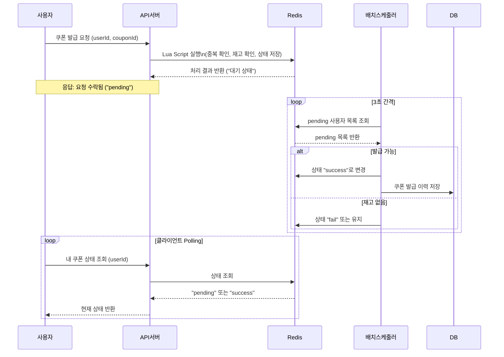
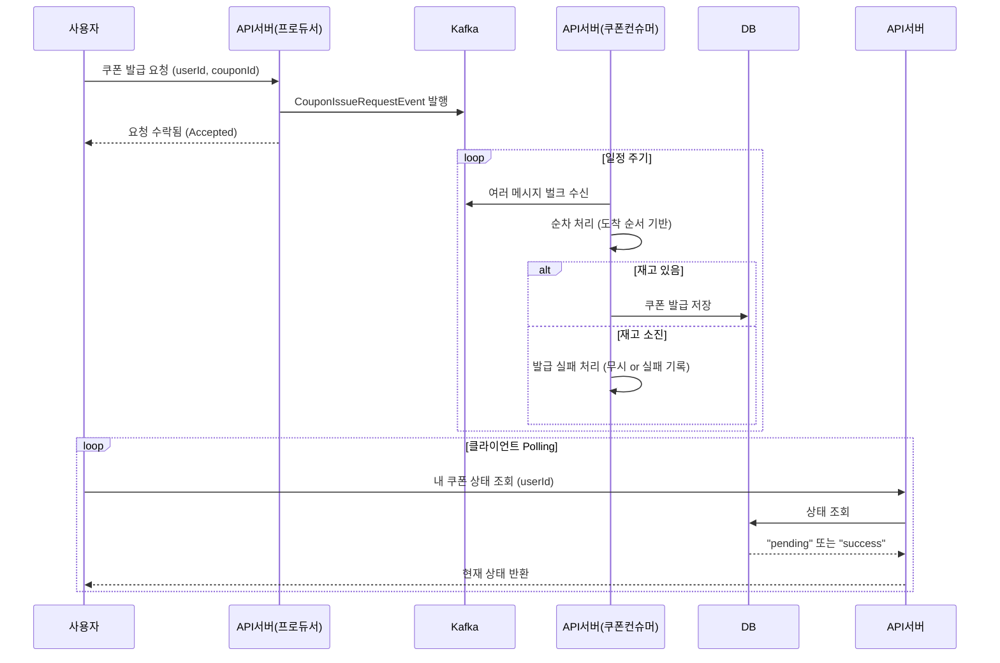

# 쿠폰 선착순 발급 시스템 Kafka 기반 개선 보고서

---

# 1. 개요

본 보고서는 쿠폰 선착순 발급 시스템을 기존 Redis 기반 구조에서 Kafka 기반 셀프 컨슈밍 구조로 개선하는 방안을 제시합니다. 실시간 처리와 확장성을 확보하기 위해 Kafka 메시지 스트리밍 플랫폼을 도입하고, 발급 프로세스를 이벤트 기반으로 전환합니다.

# 2. 기존 구조

## 2.1 처리 흐름



## 2.2 기존 선착순 쿠폰 발급 구조 요약

기존 구조는 Redis를 중심으로 한 **비동기 배치 처리 방식**입니다. 발급 요청은 즉시 처리되지 않으며, 발급 가능 여부는 배치 스케줄러가 주기적으로 판단합니다.

- **1단계: 요청 처리**
    - 사용자가 쿠폰 발급을 요청하면, Redis의 Lua Script를 통해 중복 여부, 재고 확인, 상태 저장을 **원자적으로 처리**합니다.
    - 처리된 사용자는 `"pending"` 상태로 Redis에 저장되며, 클라이언트는 요청 수락됨을 응답받습니다.
- **2단계: 배치 발급 처리**
    - 배치 스케줄러가 **3초 주기**로 Redis의 `"pending"` 목록을 조회하여 쿠폰 발급 가능 여부를 확인합니다.
    - 발급 가능하면 `"success"`로 상태를 변경하고 DB에 발급 이력을 저장합니다.
- **3단계: Polling 조회**
    - 사용자는 자신의 쿠폰 상태를 **Polling API**로 지속적으로 조회하며, 상태가 `"success"`로 변경되면 발급 완료로 인지합니다.

## 2.3 문제점

기존 Redis 기반 쿠폰 발급 방식은 빠른 응답성과 원자성 보장을 위해 적절한 선택이었지만, 다음과 같은 구조적 한계와 운영상의 문제점을 내포하고 있습니다.

- **레디스 상태 키 관리의 복잡성 증가**

  쿠폰 발급 요청 처리 시, Redis 내에서 중복 여부, 재고 여부, 발급 상태, 사용자 발급 이력 등 여러 키를 동시에 확인하고 조작해야 합니다. 이로 인해 Redis에 저장되는 키의 종류와 수가 많아지며, 상태 동기화의 복잡성이 증가합니다.

- **원자성 보장을 위한 Lua Script 의존**

  여러 Redis 연산을 하나의 트랜잭션처럼 처리하기 위해 Lua 스크립트를 사용하고 있습니다. 이는 구현 난이도를 높이며, Lua 스크립트 내 오류나 비정상 동작 시 디버깅이 어려워 운영 리스크를 증가시킵니다.


---

# 3. 개선 구조: Kafka 기반 셀프 컨슈밍

## 3.1 처리 흐름 (Self-Consuming)

> API서버(프로듀서), API서버(쿠폰컨슈머), API서버는 동일하지만 이해를 위해 분리함.
>



## 3.2 개선된 Kafka 기반 선착순 쿠폰 발급 구조 요약

Kafka를 도입한 구조에서는 발급 요청을 **비동기 이벤트**로 처리하며, **벌크 컨슈머** 방식으로 선착순을 자연스럽게 반영합니다. 이로 인해 Redis의 복잡한 키 관리와 TTL 고민이 사라지고, 처리 구조가 단순화됩니다.

- **1단계: 이벤트 발행**
    - 사용자의 쿠폰 발급 요청은 `CouponIssueRequestEvent`로 Kafka에 발행되며, API 서버는 즉시 "요청 수락됨"을 반환합니다.
- **2단계: 벌크 이벤트 소비**
    - 쿠폰 컨슈머는 Kafka로부터 이벤트를 **벌크로 수신**하고, **도착 순서 기반으로 순차 처리**합니다.
    - 재고가 있다면 DB에 발급 이력을 저장하고, 재고가 없다면 해당 요청은 무시되거나 실패 처리됩니다.
- **3단계: Polling 조회**
    - 사용자는 발급 상태를 주기적으로 조회하며, DB에서 `"pending"` 또는 `"success"` 상태를 확인할 수 있습니다.

## 3.3 주요 개선 사항

Kafka 기반 구조로의 전환은 단순한 메시지 처리 구조 변경을 넘어, 기존 Redis 기반 구조에서 발생하던 운영 복잡성과 유지보수 부담을 효과적으로 해소합니다. 다음은 구조 변경을 통해 달성된 주요 개선 사항입니다.

- Redis 의존성 감소 및 키 관리 단순화

  기존 방식에서는 쿠폰 요청 정보를 저장하기 위해 Redis에 사용자 ID, 쿠폰 재고, 발급 상태 등 다양한 형태의 키를 복합적으로 관리해야 했습니다. Kafka 기반 구조에서는 쿠폰 발급 요청을 단순한 이벤트로 처리하고 Redis에 상태를 저장하지 않으므로, **별도의 키 관리가 불필요**해졌으며 시스템의 상태 동기화 복잡도가 크게 줄었습니다.

  또한, Redis 키에 대한 **TTL(Time-To-Live) 설정이나 만료 정책**에 대한 고민 역시 더 이상 필요하지 않게 되어, 운영 부담이 대폭 감소했습니다.

- Lua 스크립트 간소화

  기존 구조에서는 Redis 내 연산을 원자적으로 수행하기 위해 복잡한 Lua 스크립트를 작성해야 했으며, 이로 인해 디버깅이 어렵고 유지보수가 까다로운 문제가 있었습니다. 구조 변경 이후에는 Kafka에 이벤트를 발행하는 단순 로직만 처리하면 되므로, Lua 스크립트는 **더 이상 필요 없거나 매우 단순한 형태로 축소**될 수 있습니다.


---

# 4. Kafka 기반 쿠폰 발급 구성 설계

Kafka는 대량의 쿠폰 발급 요청을 순차적이고 안정적으로 처리하기 위한 메시지 브로커로 활용됩니다.

본 시스템은 쿠폰 이벤트 발행 및 소비를 모두 쿠폰 서비스 내에서 처리하는 **Self-Consuming 구조**입니다.

## 4.1 주요 구성 요소

| 구성 요소 | 설명 |
| --- | --- |
| **Producer** | `CouponSpringEventPublisher` 클래스에서 Kafka에 `CouponEvent.Created` 이벤트를 발행 |
| **Consumer** | `CouponEventListener` 클래스에서 Kafka로부터 `CouponEvent.Created` 이벤트를 벌크로 수신 및 처리 |
| **Topic** | `coupon_created` – 쿠폰 발급 요청 이벤트를 처리하기 위한 단일 토픽 |
| **GroupId** | `coupon-service` – 동일 서비스 내에서 컨슈머 인스턴스 간 중복 소비 방지 |

## 4.2 이벤트 발행 구조 (Producer)

```kotlin
kafkaTemplate.send("coupon_created", event.couponId.toString(), event)
```

- **토픽명:** `coupon_created`
- **Key:** `event.couponId` (쿠폰 ID 기반 파티셔닝)
- **Value:** `CouponEvent.Created` (쿠폰 발급 요청 이벤트)
- **발행 목적:** 빠른 응답 후 비동기 처리 (사용자는 Accepted 상태 응답)
- payload

    ```json
    
    {
      "userId": "user-1234",
      "couponId": "coupon-2024",
    }
    ```


## 4.3 이벤트 소비 구조 (Bulk Consumer)

```kotlin
@KafkaListener(
    topics = ["coupon_created"],
    groupId = "coupon-service"
)
fun handle(events: List<ConsumerRecord<String, CouponEvent.Created>>, ack: Acknowledgment)
```

- **Bulk Consuming 설정:**
    - List<ConsumerRecord> 형식으로 여러 메시지를 한 번에 수신
    - 처리 후 수동 ack (ack.acknowledge())
- **Batch Consumer 처리 장점:**
    - 처리량 증가, DB 트랜잭션 최소화
    - 선착순 순서 보장

## 4.4 Topic 및 파티션 전략

| 항목 | 설정 |
| --- | --- |
| **Topic 이름** | `coupon_created` |
| **파티션 수** | `1` 또는 `N (쿠폰ID 기준 파티셔닝)` |
| **Key 전략** | `couponId`를 키로 하여 동일 쿠폰 요청은 동일 파티션에 기록 → 순서 보장 |

> 💡 파티션 수가 1개일 경우: 순서 완벽 보장
>
>
> 💡 **여러 개일 경우**: 각 쿠폰ID 단위로 병렬 발급 가능하지만, 단일 쿠폰ID 내 순서는 여전히 보장됨
>

## 4.5 컨슈머 설정 옵션 (application.yml 예시)

```yaml
yaml
복사편집
spring:
  kafka:
    consumer:
      group-id: coupon-service
      enable-auto-commit: false
      auto-offset-reset: earliest
      properties:
        max.poll.records: 100  # 벌크 단위 조절
    listener:
      type: batch
      ack-mode: manual  # 수동 커밋
```