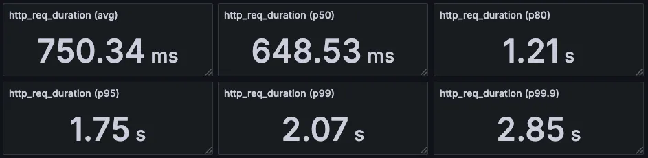
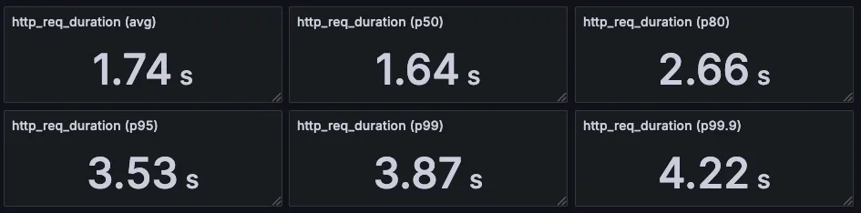
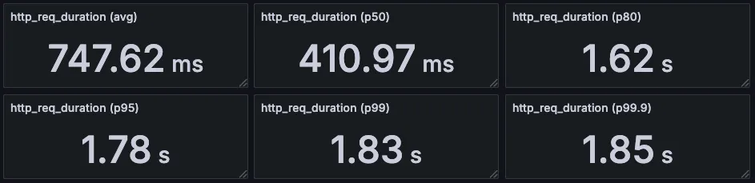
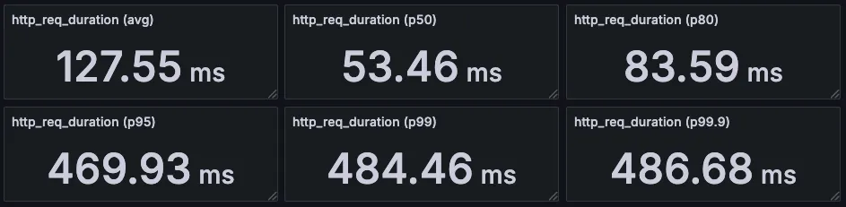

# 📄 부하 테스트 보고서

---

# 🛒 주문 및 결제 테스트

## 1. ✅ 테스트 목적

1. **고부하 환경에서 주문 및 결제 시스템의 안정성 검증**
  - 단기간에 대량의 주문 및 결제 요청이 유입될 때, 시스템이 오류 없이 안정적으로 처리할 수 있는지를 확인
  - 예: 한정 수량 이벤트 상품에 대해 수천 건의 동시 주문 요청 발생 시, 정상 주문/결제 처리 여부 검증
2. **주요 API의 성능 지표 수집 (TPS, 응답 속도, 실패율)**
  - 주문 생성 및 결제 처리 관련 API들의 초당 처리량(TPS), 평균 응답 시간, p95/p99 응답 시간, 실패율 등을 측정
  - 목표 SLA(예: 95% 요청은 500ms 이내 응답, 실패율 1% 이하)를 충족하는지 평가
3. **트랜잭션 일관성과 데이터 무결성 검증**
  - 고부하 시에도 재고 차감, 포인트 사용, 쿠폰 적용, 결제 승인 등 핵심 트랜잭션이 중단 없이 정확히 수행되는지 확인
  - 주문 중복 처리, 이중 결제, 재고 마이너스 등 예외 발생 여부 점검
4. **동시성 및 경합 상황 테스트**
  - 동일 상품을 대상으로 여러 사용자가 거의 동시에 주문을 요청할 때 발생할 수 있는 경쟁 조건(Race Condition), 락 경합, 데드락 등의 문제 탐지
  - Optimistic Lock / Pessimistic Lock / 분산 락(Redis 등) 적용 효과 검증
5. **서버 및 인프라 자원 사용량 관찰**
  - 테스트 수행 중 CPU, 메모리, DB 커넥션, Redis 처리량 등 인프라 자원 사용량을 모니터링하여 병목 요소 식별
  - 단일 서버 기준으로 최대 처리 가능 주문량 추정 및 수평 확장의 기준 수립

## 2. ⚙️ 테스트 방식

- **도구**: k6 오픈소스 부하 테스트 도구
- **시나리오 유형**: 특정한 부하를 제한된 시간 동안 제공해 부하를 정상적으로 처리할 수 있는지 평가 (Load Test)
- **사용자 수(VUs)**: 15 ~ 200명 구간에서 다양하게 설정
- **Duration**: 30~32초간 부하 유지
- **요청 방식**: HTTP POST 요청
- **응답 확인 조건**: 성공

## 3. 🎯 목표 성능 지표

| 항목 | 목표 기준 |
| --- | --- |
| 평균 응답 시간 | 1s 이하 |
| 95% 응답 시간 (p95) | 1s 이하 |
| TPS (Transactions Per Second) | 100 TPS 이상 |

## 4. ⌛ 테스트 대상 및 시나리오

### ✅ **테스트 대상**

| 구분 | 설명 |
| --- | --- |
| **API 엔드포인트** | POST /order?userId={userId} |
| **대상 기능** | 사용자 주문 생성 (상품 ID, 수량 포함) |
| **주요 처리 로직** | 주문 요청에 따라 상품 재고 차감 및 주문 생성 처리 |

### 🧪 **테스트 시나리오 - VUs: 200**

1. 200명의 가상 사용자가 동시에 30초 동안 주문 요청
2. 각 요청은 랜덤한 상품(ID: 1~10)과 랜덤한 수량(1~5)을 포함
3. userId는 가상 사용자 번호로 설정하여 고유하게 유지
4. Redis 또는 DB를 통한 재고 차감 및 주문 처리 성능 평가
5. 전체 응답 시간, 실패율, TPS 등 주요 지표 수집

#### ▶️ 테스트 스크립트

```jsx
import http from 'k6/http';
import { check, sleep } from 'k6';

export const options = {
    vus: 200,
    duration: '30s',
    thresholds: {
        http_req_failed: ['rate<0.01'],      // 실패율 1% 이하
        http_req_duration: ['p(95)<1000'],    // 95%가 1s 이하
    },
};

export default function () {
    const userId = Math.floor(Math.random() * 10) + 1; // 1~10 사이 유저
    const productId = Math.floor(Math.random() * 10) + 1; // 1~10 사이 랜덤 상품
    const quantity = Math.floor(Math.random() * 5) + 1;   // 1~5개 랜덤 수량

    const url = `http://host.docker.internal:8080/order?userId=${userId}`;
    const payload = JSON.stringify({
        products: [
            {
                productId: productId,
                quantity: quantity,
            },
        ],
    });

    const params = {
        headers: {
            'Content-Type': 'application/json',
        },
    };

    const res = http.post(url, payload, params);

    check(res, {
        'status is 200': (r) => r.status === 200,
    });

    sleep(1);
}

```

#### 📈 k6 실행 결과 요약

| 항목 | 결과 |
| --- | --- |
| 총 요청 수 (http_reqs) | 3,511건 |
| 평균 요청 처리 속도 | 약 110.7 요청/초 |
| 성공 응답 수 (status 200) | 3,511건 (100%) ✅ |
| 실패 응답 수 | 0건 (0%) ✅ |
| 평균 응답 시간 (http_req_duration) | 750ms |
| 95% 응답 시간 (p(95)) | 1.74초 ❌ (목표 1초 미만) |
| 최대 응답 시간 | 3.83초 |
| 오류율 (http_req_failed) | 0% ✅ |

#### 🔍 Grafana 상세 지표

- avg, p50, p80, p95, p99, p99.9

  

- TPS

    | 항목 | 값 |
    | --- | --- |
    | 총 요청 수 | 3511건 |
    | 테스트 시간 | 31.7초 |
    | TPS (평균) | **110.7 요청/초** |
    
    → 즉, 이 테스트에서 시스템은 **초당 약 110건의 요청을 처리**할 수 있었던 것으로 나타납니다.

### 🔍 추가 분석

- 전체 요청이 정상 처리되었으며 오류율은 0%로 매우 안정적입니다.
- 95백분위 응답 시간이 1.74초로 목표(1초 이하)를 초과하여, 응답 지연 개선이 필요합니다.
- 평균 응답 시간은 750ms로 비교적 양호하지만, 최대 응답 시간 3.83초는 부하 구간에서 지연이 발생함을 시사합니다.
- 약 110.7 TPS 처리량은 충분한 수준이나, 지연 시간 개선에 집중할 필요가 있습니다.

### 🧪 **테스트 시나리오 - VUs: 150**

1. 150명의 가상 사용자가 동시에 30초 동안 주문 요청
2. 각 요청은 랜덤한 상품(ID: 1~10)과 랜덤한 수량(1~5)을 포함
3. userId는 가상 사용자 번호로 설정하여 고유하게 유지
4. Redis 또는 DB를 통한 재고 차감 및 주문 처리 성능 평가
5. 전체 응답 시간, 실패율, TPS 등 주요 지표 수집

#### ▶️ 테스트 스크립트

```jsx
import http from 'k6/http';
import { check, sleep } from 'k6';

export const options = {
    vus: 150,
    duration: '30s',
    thresholds: {
        http_req_failed: ['rate<0.01'],      // 실패율 1% 이하
        http_req_duration: ['p(95)<1000'],    // 95%가 1s 이하
    },
};

export default function () {
    const userId = Math.floor(Math.random() * 10) + 1; // 1~10 사이 유저
    const productId = Math.floor(Math.random() * 10) + 1; // 1~10 사이 랜덤 상품
    const quantity = Math.floor(Math.random() * 5) + 1;   // 1~5개 랜덤 수량

    const url = `http://host.docker.internal:8080/order?userId=${userId}`;
    const payload = JSON.stringify({
        products: [
            {
                productId: productId,
                quantity: quantity,
            },
        ],
    });

    const params = {
        headers: {
            'Content-Type': 'application/json',
        },
    };

    const res = http.post(url, payload, params);

    check(res, {
        'status is 200': (r) => r.status === 200,
    });

    sleep(1);
}

```

#### 📈 k6 실행 결과 요약

| 항목 | 결과 |
| --- | --- |
| 총 요청 수 (http_reqs) | 3,464건 |
| 평균 요청 처리 속도 | 111.05 요청/초 |
| 성공 응답 수 (status 200) | 3,464건 (100%) ✅ |
| 실패 응답 수 | 0건 (0%) ✅ |
| 평균 응답 시간 | 318.05ms |
| 95% 응답 시간 (p(95)) | 897.7ms ✅ *(목표: 1000ms 이하)* |
| 최대 응답 시간 | 2.03초 |
| 오류율 (http_req_failed) | 0% ✅ *(목표: 1% 미만)* |

#### 🔍 Grafana 상세 지표

- avg, p50, p80, p95, p99, p99.9

  

- TPS

    | 항목 | 값 |
    | --- | --- |
    | 총 요청 수 | 3464건 |
    | 테스트 시간 | 31.2초 |
    | TPS (평균) | **111.0 요청/초** |
    
    → 즉, 이 테스트에서 시스템은 **초당 약 110건의 요청을 처리**할 수 있었던 것으로 나타납니다.


## 📌 결론

약 110 TPS에서 95% 응답 시간 897.7ms로 목표(1s 미만)를 충족하였습니다.

# 🎟️ 선착순 쿠폰 발급 테스트

## 1. ✅ 테스트 목적

1. **고부하 상황에서 시스템 안정성 검증**
  - 제한된 쿠폰 수량(예: 100개)을 동시에 많은 사용자가 요청할 때, 서버가 정상적으로 처리 가능한지 확인
  - 쿠폰 수량 초과 요청을 정확하게 차단하고, 중복 요청에 대해 올바른 응답을 반환하는지 점검
2. **성능 및 응답 시간 측정**
  - 쿠폰 발급 API가 Peak 부하 상황에서 얼마나 빠르게 응답하는지 측정
  - 목표 SLA(예: 95% 요청은 500ms 이내 응답)를 충족하는지 평가
3. **비즈니스 요구사항 충족 확인**
  - 쿠폰이 오직 선착순 수량 내에서만 발급되고, 이후 요청은 적절히 거절되는지 확인
  - 사용자 경험을 해치지 않고, 시스템이 예상대로 동작하는지 검증
4. **병목 구간 및 장애 요소 식별**
  - 부하 테스트 결과를 통해 API 성능 저하 구간, Redis 처리 한계, DB 병목 등을 찾아내어 개선점 도출

## 2. ⚙️ 테스트 방식

- **도구**: k6 오픈소스 부하 테스트 도구
- **시나리오 유형**: 단 시간에 고정된 사용자 수로 요청을 한 번에 실행 (Peak Test)
- **사용자 수(VUs)**: 15 ~ 200명 구간에서 다양하게 설정
- **Duration**: 5~6초간 부하 유지
- **요청 방식**: HTTP POST 요청
- **응답 확인 조건**: 성공, 실패 구분 X

## 3. 🎯 목표 성능 지표

| 항목 | 목표 기준 |
| --- | --- |
| 평균 응답 시간 | 500ms 이하 |
| 95% 응답 시간 (p95) | 500ms 이하 |
| TPS (Transactions Per Second) | 100 TPS 이상 |

## 4. 테스트 대상 및 시나리오

### ✅ **테스트 대상**

| 구분 | 설명 |
| --- | --- |
| **API 엔드포인트** | POST /coupon/reserve |
| **대상 기능** | 선착순 쿠폰 발급 (Redis 기반 발급 요청 수량 관리) |
| **발급 조건** | 쿠폰 수량이 남아 있을 경우만 발급 가능 + 한 사용자당 1회만 발급 가능 |

### 🧪 **테스트 시나리오 - VUs:** 500

1. 500명의 가상 사용자가 동시에 couponId=1을 발급 요청
2. Redis에는 미리 1000개 수량이 등록되어 있음
3. 시스템은 요청을 빠르게 처리하여 선착순 1000명에게만 발급
4. 그 외 요청자는 "OUT_OF_STOCK" 예외
5. 이미 요청한 사용자는 "ALREADY_REQUESTED" 예외
6. 전체 응답 속도와 실패율을 수집하여 목표 기준 충족 여부 판단

#### ▶️ 테스트 스크립트

```jsx
export const options = {
    vus: 500, // 500명 (동시 요청 최대)
    duration: '5s', // 짧게 한 번에 부하 주기
    thresholds: {
        http_req_duration: ['p(95)<500'], // 95% 요청이 500ms 이하
    },
};

export default function () {
    const totalUsers = 1000;
    const userId = ((__VU - 1) * 2 + __ITER + 1) % totalUsers + 1;

    const url = `http://host.docker.internal:8080/coupon/reserve`;

    const payload = JSON.stringify({
        userId: userId,
        couponId: 1,
    });

    const params = {
        headers: {
            'Content-Type': 'application/json',
        },
    };

    const res = http.post(url, payload, params);

    check(res, {
        'status is 200': (r) => r.status === 200,
    });

    sleep(1);
}
```

#### 📈 k6 실행 결과 요약

| 항목 | 결과 |
| --- | --- |
| 총 요청 수 (`http_reqs`) | 1,270건 |
| 평균 요청 속도 | 133건/초 |
| 성공 응답 수 (`status 200`) | 1,000건 (78.74%) |
| 실패 응답 수 | 270건 (21.25%) |
| 평균 응답 시간 | 1.73초 |
| 95% 응답 시간 (`p(95)`) | **3.52초** ❌ (목표 초과) |
| 최대 응답 시간 | 4.31초 |

#### 🔍 Grafana 상세 지표

- avg, p50, p80, p95, p99, p99.9

  

- TPS

    | 항목 | 값 |
    | --- | --- |
    | 총 요청 수 | 1,270건 |
    | 테스트 시간 | 5초 |
    | TPS (평균) | **133.28 요청/초** |
    
    → 즉, 이 테스트에서 시스템은 **초당 약 133건의 요청을 처리**할 수 있었던 것으로 나타납니다.


### 🧪 **테스트 시나리오 - VUs: 100**

1. 100명의 가상 사용자가 동시에 couponId=1을 발급 요청
2. Redis에는 미리 1000개 수량이 등록되어 있음
3. 시스템은 요청을 빠르게 처리하여 선착순 1000명에게만 발급
4. 그 외 요청자는 "OUT_OF_STOCK" 예외
5. 이미 요청한 사용자는 "ALREADY_REQUESTED" 예외
6. 전체 응답 속도와 실패율을 수집하여 목표 기준 충족 여부 판단

#### ▶️ 테스트 스크립트

```jsx
export const options = {
    vus: 100, // 100명 (동시 요청 최대)
    duration: '5s', // 짧게 한 번에 부하 주기
    thresholds: {
        http_req_duration: ['p(95)<500'], // 95% 요청이 500ms 이하
    },
};

export default function () {
    const totalUsers = 1000;
    const userId = ((__VU - 1) * 2 + __ITER + 1) % totalUsers + 1;

    const url = `http://host.docker.internal:8080/coupon/reserve`;

    const payload = JSON.stringify({
        userId: userId,
        couponId: 1,
    });

    const params = {
        headers: {
            'Content-Type': 'application/json',
        },
    };

    const res = http.post(url, payload, params);

    check(res, {
        'status is 200': (r) => r.status === 200,
    });

    sleep(1);
}
```

#### 📈 k6 실행 결과 요약

| 항목 | 결과 |
| --- | --- |
| 총 요청 수 (`http_reqs`) | 325건 |
| 평균 요청 속도 | 50.65건/초 |
| 성공 응답 수 (`status 200`) | 201건 (61.84%) |
| 실패 응답 수 | 124건 (38.15%) |
| 평균 응답 시간 | 746.33ms |
| 95% 응답 시간 (`p(95)`) | **1.78초** ❌ (목표 초과) |
| 최대 응답 시간 | 1.84초 |

#### 🔍 Grafana 상세 지표

- avg, p50, p80, p95, p99, p99.9

  

- TPS

    | 항목 | 값 |
    | --- | --- |
    | 총 요청 수 | 325건 |
    | 테스트 시간 | 5초 |
    | TPS (평균) | **50.78 요청/초** |
    
    → 즉, 이 테스트에서 시스템은 **초당 약 50건의 요청을 처리**할 수 있었던 것으로 나타납니다.


### 🧪 **테스트 시나리오 - VUs: 15**

1. 15명의 가상 사용자가 동시에 couponId=1을 발급 요청
2. Redis에는 미리 1000개 수량이 등록되어 있음
3. 시스템은 요청을 빠르게 처리하여 선착순 1000명에게만 발급
4. 그 외 요청자는 "OUT_OF_STOCK" 예외
5. 이미 요청한 사용자는 "ALREADY_REQUESTED" 예외
6. 전체 응답 속도와 실패율을 수집하여 목표 기준 충족 여부 판단

#### ▶️ 테스트 스크립트

```jsx
export const options = {
    vus: 15, // 15명 (동시 요청 최대)
    duration: '5s', // 짧게 한 번에 부하 주기
    thresholds: {
        http_req_duration: ['p(95)<500'], // 95% 요청이 500ms 이하
    },
};

export default function () {
    const totalUsers = 1000;
    const userId = ((__VU - 1) * 2 + __ITER + 1) % totalUsers + 1;

    const url = `http://host.docker.internal:8080/coupon/reserve`;

    const payload = JSON.stringify({
        userId: userId,
        couponId: 1,
    });

    const params = {
        headers: {
            'Content-Type': 'application/json',
        },
    };

    const res = http.post(url, payload, params);

    check(res, {
        'status is 200': (r) => r.status === 200,
    });

    sleep(1);
}
```

#### 📈 k6 실행 결과 요약

| 항목 | 결과 |
| --- | --- |
| 총 요청 수 (`http_reqs`) | 75건 |
| 평균 요청 속도 | 13.16건/초 |
| TPS (초당 처리 건수) | **약 13.16 TPS** |
| 성공 응답 수 (`status 200`) | 33건 (44.00%) |
| 실패 응답 수 | 42건 (56.00%) |
| 평균 응답 시간 | 127.55ms |
| 95% 응답 시간 (`p(95)`) | **469.98ms** ✅ (목표 만족) |
| 최대 응답 시간 | 486.67ms |

#### 🔍 Grafana 상세 지표

- avg, p50, p80, p95, p99, p99.9

  

- TPS

    | 항목 | 값 |
    | --- | --- |
    | 총 요청 수 | 75건 |
    | 테스트 시간 | 5.7초 |
    | TPS (평균) | **13.16 요청/초** |
    
    → 즉, 이 테스트에서 시스템은 **초당 약 13건의 요청을 처리**할 수 있었던 것으로 나타납니다.


## 📌 결론

약 13 TPS에서 95% 응답 시간 469.98ms로 목표(500ms 미만)를 충족하였습니다.