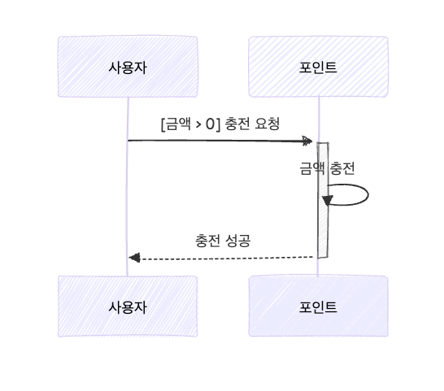
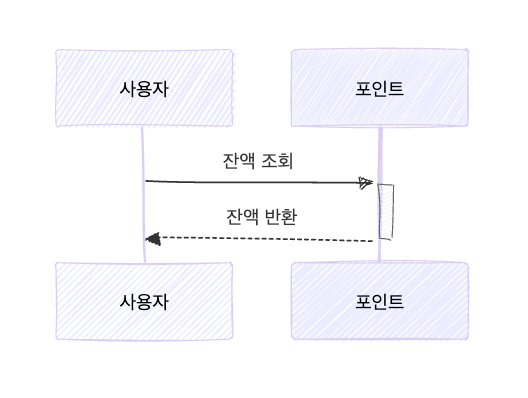
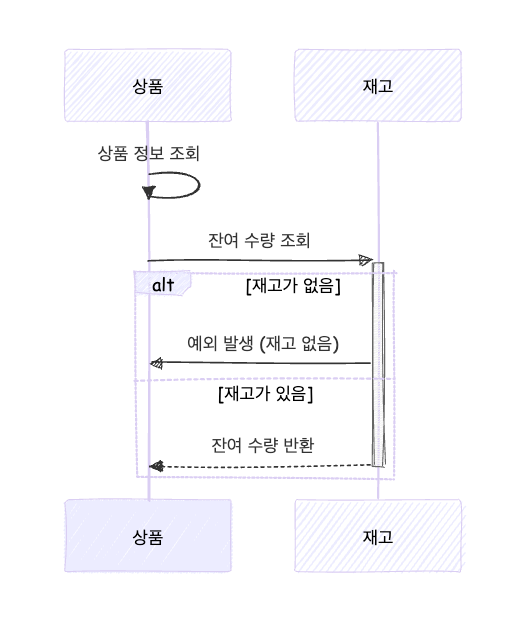
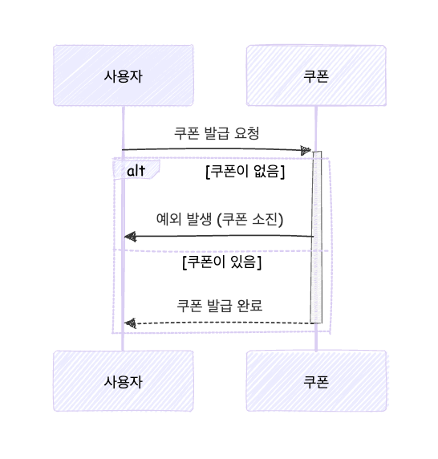
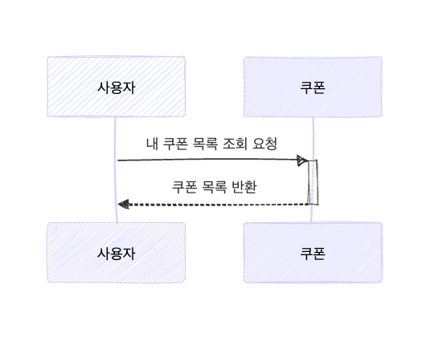
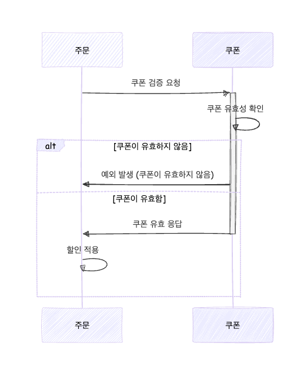
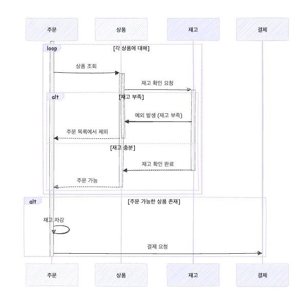
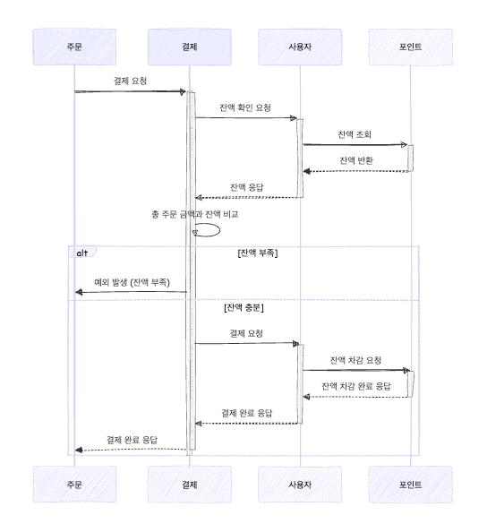
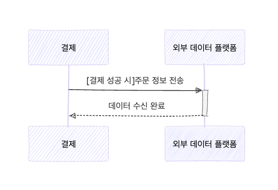
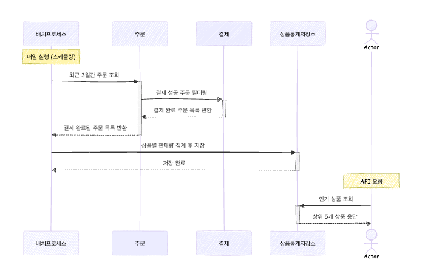

# 시퀀스 다이어그램

## 1. 잔액 충전 / 조회 API
### 1-1. 사용자 식별자 및 충전할 금액을 받아 잔액을 충전합니다.

 

### 1-2. 사용자 식별자를 통해 해당 사용자의 잔액을 조회합니다.

 

## 2. 상품 조회 API
### 2-1. 상품 정보 ( ID, 이름, 가격, 잔여수량 ) 을 조회합니다.

 

## 3. 선착순 쿠폰 기능
### 3-1. 사용자는 선착순으로 쿠폰을 발급받을 수 있어야 합니다.

 

### 3-2. 발급된 쿠폰 목록을 조회할 수 있어야 합니다.

 

### 3-3. 주문 시 유효한 쿠폰을 제출하면 전체 주문 금액에 대해 할인이 적용되어야 합니다.

 

## 4. 주문 / 결제 API
### 4-1. 사용자는 (상품 ID, 수량) 목록을 입력하여 주문할 수 있어야 합니다.

 

### 4-2. 주문 시 결제는 기존에 충전된 잔액을 사용하여 수행합니다. 결제 성공 시 잔액이 차감되어야 합니다.

 

### 4-3. 결제 성공 시 주문 정보를 외부 데이터 플랫폼으로 전송합니다.

 

## 5. 상위 상품 조회 API
### 5-1. 최근 3일간 가장 많이 팔린 상위 5개 상품 정보를 제공합니다.
