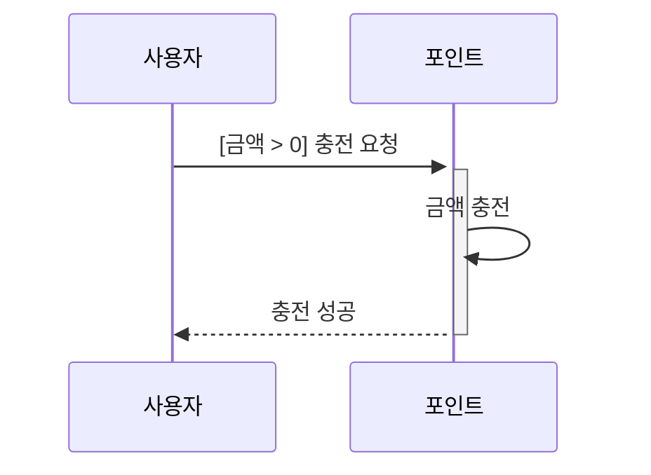
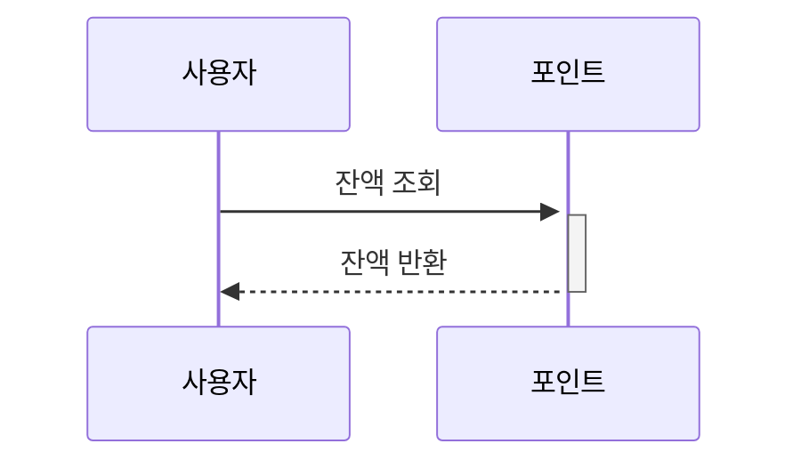
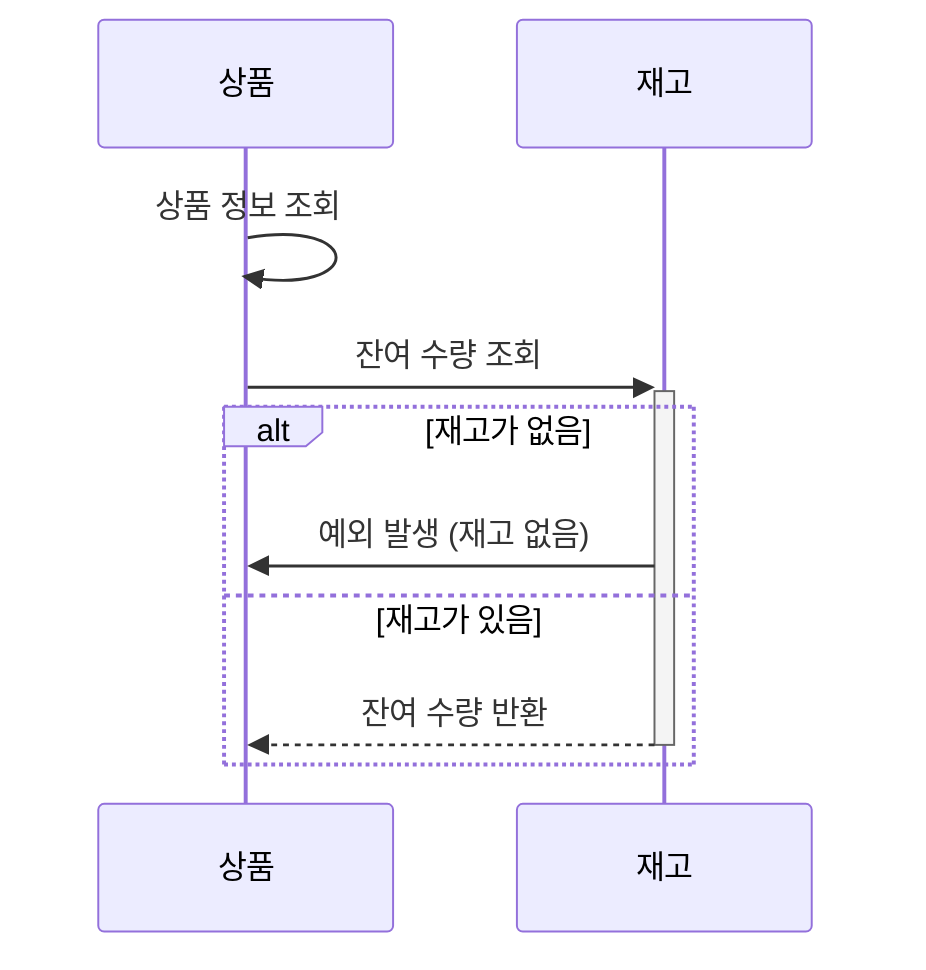
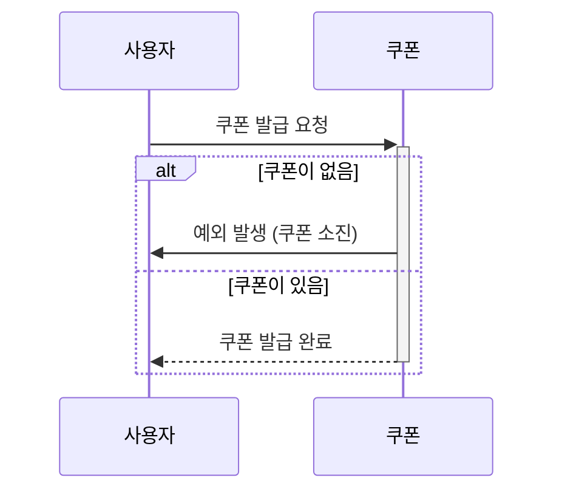
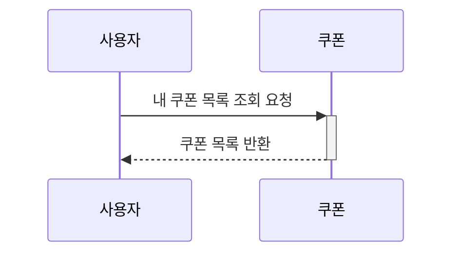
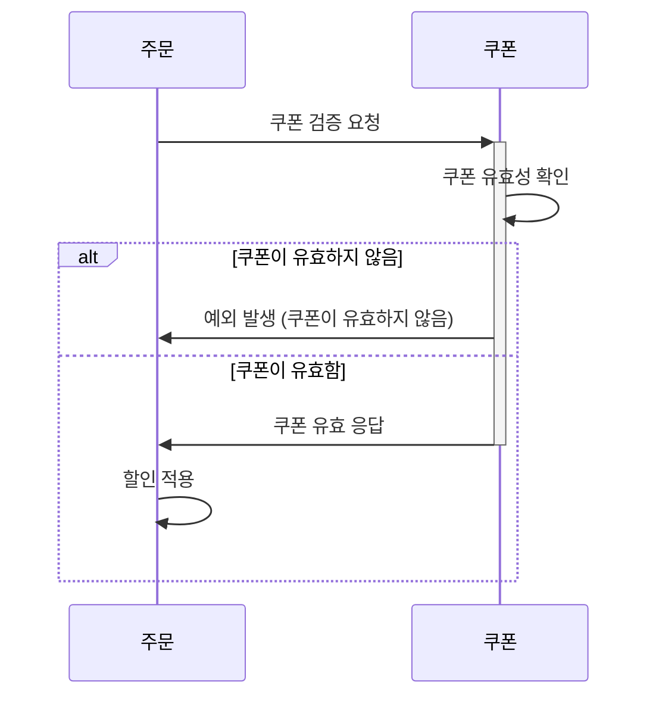
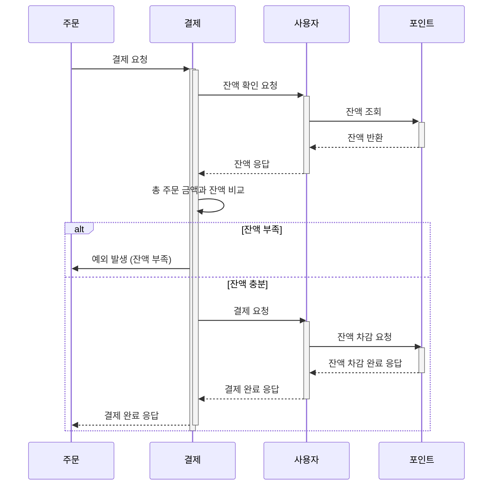
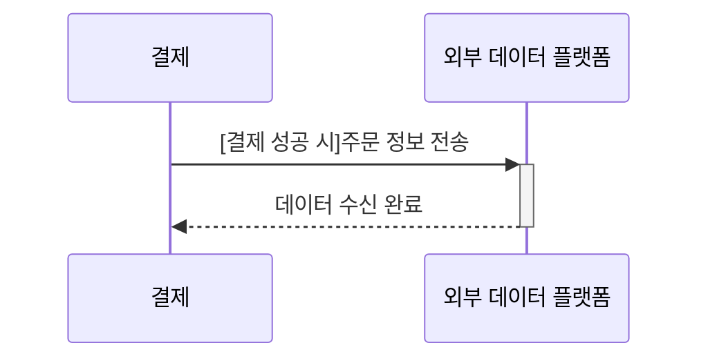
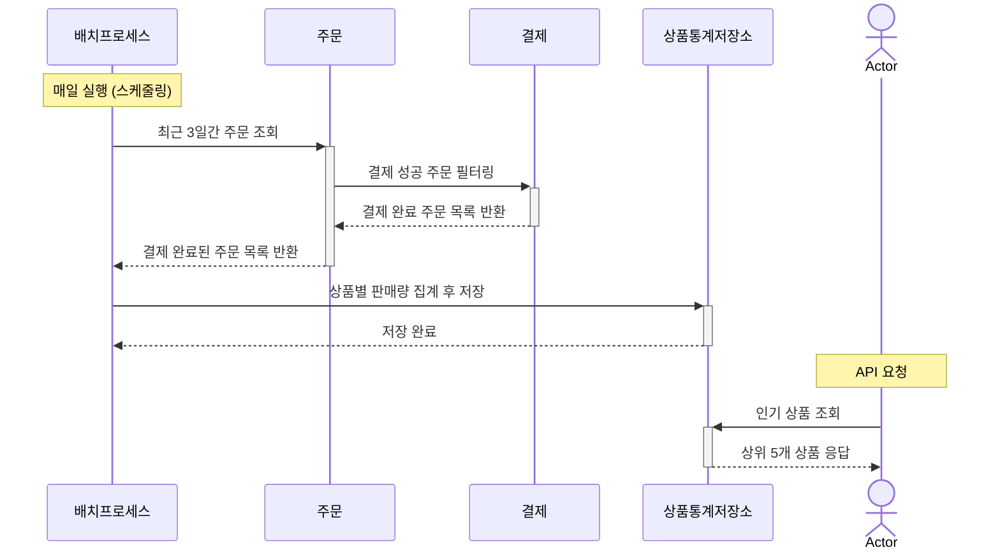

# 시퀀스 다이어그램

## 1. 잔액 충전 / 조회 API
### 1-1. 사용자 식별자 및 충전할 금액을 받아 잔액을 충전합니다.


<br>

### 1-2. 사용자 식별자를 통해 해당 사용자의 잔액을 조회합니다.


<br>

## 2. 상품 조회 API
### 2-1. 상품 정보 ( ID, 이름, 가격, 잔여수량 ) 을 조회합니다.


<br>

## 3. 선착순 쿠폰 기능
### 3-1. 사용자는 선착순으로 쿠폰을 발급받을 수 있어야 합니다.


<br>

### 3-2. 발급된 쿠폰 목록을 조회할 수 있어야 합니다.


<br>

### 3-3. 주문 시 유효한 쿠폰을 제출하면 전체 주문 금액에 대해 할인이 적용되어야 합니다.


<br>

## 4. 주문 / 결제 API
### 4-1. 사용자는 (상품 ID, 수량) 목록을 입력하여 주문할 수 있어야 합니다.
```mermaid
sequenceDiagram
    사용자->>+주문: 주문 요청
    activate 주문

    loop 각 상품에 대해
        주문->>+상품: 상품 조회
        activate 상품
        상품->>+재고: 재고 확인 요청
        alt 재고 부족
            재고->>상품: 예외 발생 (재고 부족)
            상품-->>-주문: 주문 목록에서 제외
        else 재고 충분
            재고-->>-상품: 재고 확인 완료
            상품-->>-주문: 주문 가능
        end
    end

    alt 주문 가능한 상품 존재
        주문->>주문: 재고 차감
        주문-->>사용자: 주문 성공 응답
    else 모든 상품 재고 부족
        주문-->>사용자: 주문 실패 응답
    end

    deactivate 주문
   
    
---
sequenceDiagram
    activate 주문

    loop 각 상품에 대해
        주문->>+상품: 상품 조회
        activate 상품
        상품->>+재고: 재고 확인 요청
        alt 재고 부족
            재고->>상품: 예외 발생 (재고 부족)
            상품-->>-주문: 주문 목록에서 제외
        else 재고 충분
            재고-->>-상품: 재고 확인 완료
            상품-->>-주문: 주문 가능
        end
    end

    alt 주문 가능한 상품 존재
        주문->>주문: 재고 차감
        주문->>결제: 결제 요청
    end

    deactivate 주문
```

<br>

### 4-2. 주문 시 결제는 기존에 충전된 잔액을 사용하여 수행합니다. 결제 성공 시 잔액이 차감되어야 합니다.


<br>

### 4-3. 결제 성공 시 주문 정보를 외부 데이터 플랫폼으로 전송합니다.


<br>

## 5. 상위 상품 조회 API
### 5-1. 최근 3일간 가장 많이 팔린 상위 5개 상품 정보를 제공합니다.
