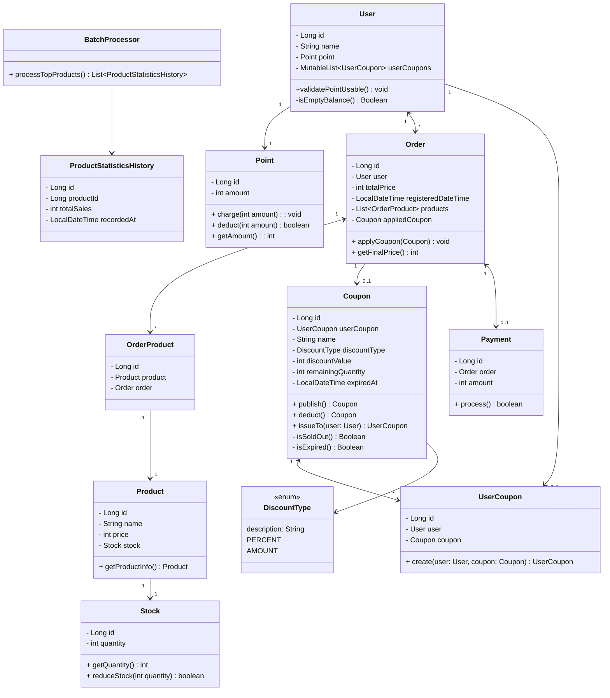

# 클래스 다이어그램

```mermaid
classDiagram
    %% 통계 및 배치 관련 클래스
    class ProductStatisticsHistory {
        - Long id
        - Long productId
        - int totalSales
        - LocalDateTime recordedAt
    }

    class BatchProcessor {
        + processTopProducts() List~ProductStatisticsHistory~
    }

    %% 사용자 관련 클래스
    class User {
        - Long id
        %% 사용자 ID
        - String name
        %% 사용자 이름
        - Point point
        %% 잔액(포인트)
        - MutableList~UserCoupon~ userCoupons
        %% 보유 쿠폰 목록
        
        +validatePointUsable() void
        -isEmptyBalance() Boolean
    }

    class Point {
        - Long id
        %% 포인트 ID
        - int amount
        %% 금액
        + charge(int amount): void
        + deduct(int amount) boolean
        + getAmount(): int
    }

    class Coupon {
        - Long id
        %% 쿠폰 ID
        - UserCoupon userCoupon
        %% 발급된 사용자 쿠폰
        - String name
        %% 쿠폰 이름
        - DiscountType discountType
        %% 할인 타입
        - int discountValue
        %% 할인 값
        - int remainingQuantity
        %% 남은 수량
        - LocalDateTime expiredAt
        %% 만료 시간
        
        + publish() Coupon
        + deduct() Coupon
        + issueTo(user: User) UserCoupon
        - isSoldOut() Boolean
        - isExpired() Boolean
    }

    class DiscountType {
        <<enum>>
        description: String
        %% 설명
        PERCENT
        %% 퍼센트 할인
        AMOUNT
        %% 금액 할인
    }

    class UserCoupon {
        - Long id
        %% 사용자-쿠폰 매핑 ID
        - User user
        %% 소유한 사용자
        - Coupon coupon
        %% 보유한 쿠폰
        
        + create(user: User, coupon: Coupon) UserCoupon
    }

    %% 상품 관련 클래스
        class Product {
        - Long id
        %% 상품 ID
        - String name
        %% 상품명
        - int price
        %% 상품 가격
        - Stock stock
        %% 재고
        + getProductInfo() Product
    }

    class Stock {
        - Long id
        %% 재고 ID
        - int quantity
        %% 수량
        + getQuantity() int
        + reduceStock(int quantity) boolean
    }

    %% 주문 및 결제 관련 클래스
    class Order {
        - Long id
        %% 주문 ID
        - User user
        %% 주문한 사용자
        - int totalPrice
        %% 총 주문 금액
        - LocalDateTime registeredDateTime
        %% 주문 등록 일시
        - List~OrderProduct~ products
        %% 주문한 상품 목록
        - Coupon appliedCoupon
        %% 적용한 쿠폰
        + applyCoupon(Coupon) void
        + getFinalPrice() int
    }

    class OrderProduct {
        - Long id
        %% 주문 상품 ID
        - Product product
        %% 주문한 상품
        - Order order
        %% 속한 주문
    }

    class Payment {
        - Long id
        %% 결제 ID
        - Order order
        %% 속한 주문
        - int amount
        %% 결제 금액
        + process() boolean
    }

    %% 관계 정의
    User "1" --> "1" Point
    User "1" <--> "*" Order
    User "1" --> "0..*" UserCoupon
    Coupon "1" <--> "*" UserCoupon
    Coupon --> DiscountType

    Order "1" <--> "*" OrderProduct
    Order "1" --> "0..1" Coupon
    Order "1" <--> "0..1" Payment

    OrderProduct "1" --> "1" Product
    Product "1" --> "1" Stock

    BatchProcessor ..> ProductStatisticsHistory
```