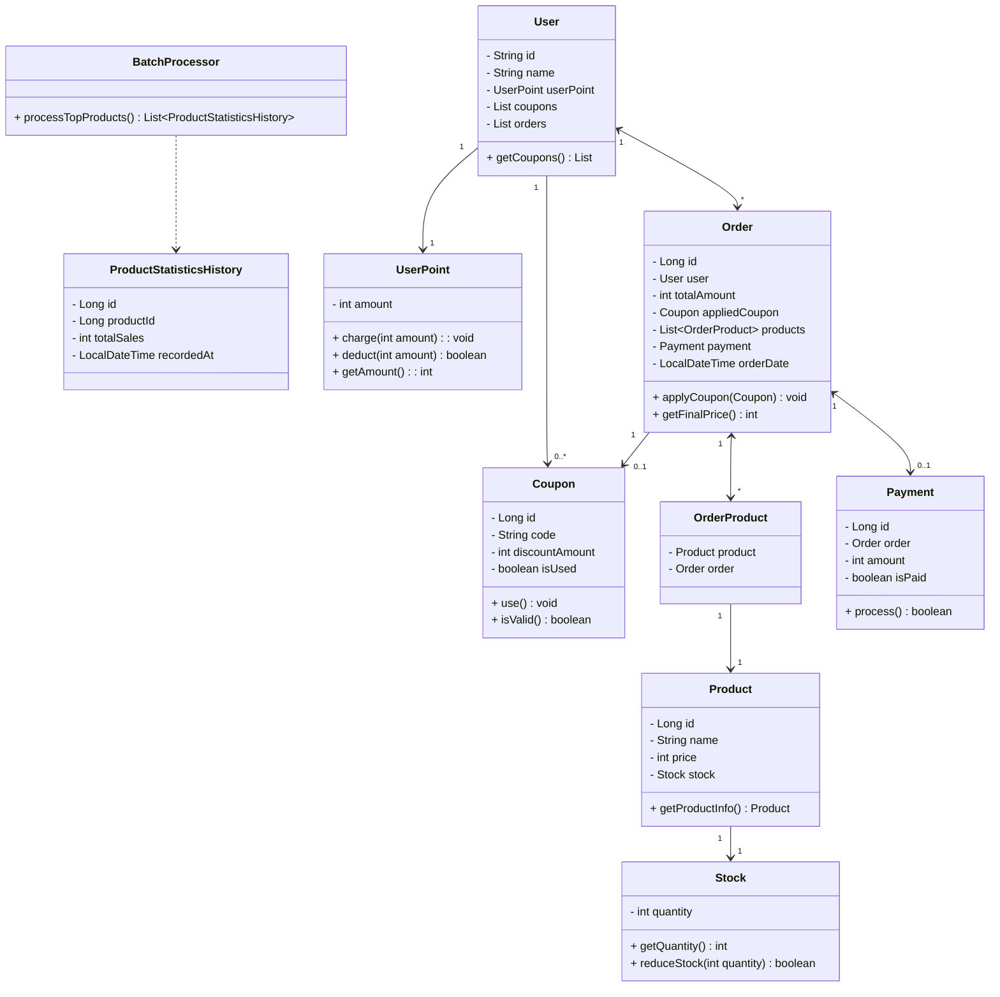

# 클래스 다이어그램

```mermaid
classDiagram
    %% 통계 및 배치 관련 클래스
    class ProductStatisticsHistory {
        - Long id
        - Long productId
        - int totalSales
        - LocalDateTime recordedAt
    }

    class BatchProcessor {
        + processTopProducts() List~ProductStatisticsHistory~
    }

    %% 사용자 관련 클래스
    class User {
        - String id
        - String name
        - UserPoint userPoint
        - List<Coupon> coupons
        - List<Order> orders
        + getCoupons() List<Coupon>
    }

    class UserPoint {
        - int amount
        + charge(int amount): void
        + deduct(int amount) boolean
        + getAmount(): int
    }

    class Coupon {
        - Long id
        - String code
        - int discountAmount
        - boolean isUsed
        + use() void
        + isValid() boolean
    }

    %% 상품 관련 클래스
    class Product {
        - Long id
        - String name
        - int price
        - Stock stock
        + getProductInfo() Product
    }

    class Stock {
        - int quantity
        + getQuantity() int
        + reduceStock(int quantity) boolean
    }

    %% 주문 및 결제 관련 클래스
    class Order {
        - Long id
        - User user
        - int totalAmount
        - Coupon appliedCoupon
        - List~OrderProduct~ products
        - Payment payment
        - LocalDateTime orderDate
        + applyCoupon(Coupon) void
        + getFinalPrice() int
    }

    class OrderProduct {
        - Product product
        - Order order
    }

    class Payment {
        - Long id
        - Order order
        - int amount
        - boolean isPaid
        + process() boolean
    }

    %% 관계 정의
    User "1" --> "1" UserPoint
    User "1" <--> "*" Order
    User "1" --> "0..*" Coupon

    Order "1" <--> "*" OrderProduct
    Order "1" --> "0..1" Coupon
    Order "1" <--> "0..1" Payment

    OrderProduct "1" --> "1" Product
    Product "1" --> "1" Stock

    BatchProcessor ..> ProductStatisticsHistory
```